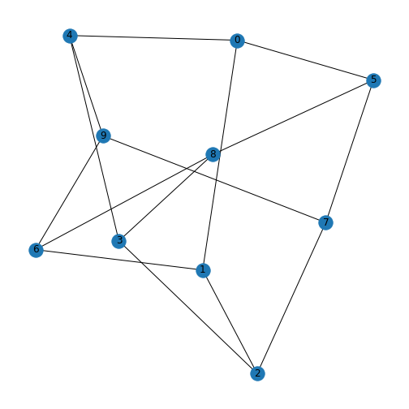
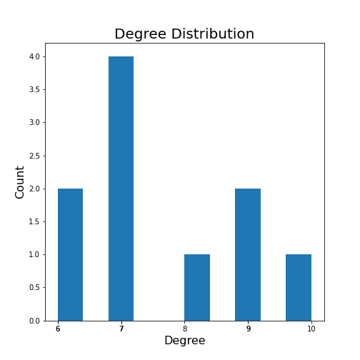
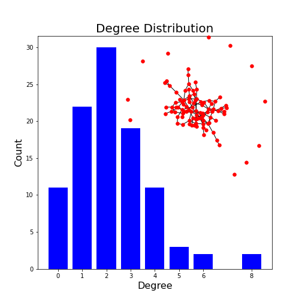

[**Download Chapter notebook (ipynb)**](02-networks_2.ipynb)

[<span style="color: rgb(255, 0, 0);">**Mandatory Lesson Feedback Survey**</span>](https://docs.google.com/forms/d/e/1FAIpQLSdr0capF7jloJhPH3Pki1B3LZoKOG16poOpuVJ7SL2LkwLHQA/viewform?pli=1)


::::::::::::::::::::::::::::::::::::: questions

- How to generate test matrices using NetworkX?
- What is the purpose of the node degree and the degree distribution?
- How can a network be quantified?
::::::::::::::::::::::::::::::::::::::::::::::::

::::::::::::::::::::::::::::::::::::: objectives
- Creating network matrices with random edges.
- Quantifying network properties.
- Applying networks concepts to the C. elegans neural network.
::::::::::::::::::::::::::::::::::::::::::::::::

<br>
<p align = "center">
<iframe width="560" height="315" src="https://www.youtube.com/embed/nU8ossLYBc4" title="YouTube video player" frameborder="0" allow="accelerometer; autoplay; clipboard-write; encrypted-media; gyroscope; picture-in-picture" allowfullscreen></iframe>
</p>
<br>
<p align = "center">
<iframe width="560" height="315" src="https://www.youtube.com/embed/3MQNgrtjY-A" title="YouTube video player" frameborder="0" allow="accelerometer; autoplay; clipboard-write; encrypted-media; gyroscope; picture-in-picture" allowfullscreen></iframe>
</p>
<br>
<p align = "center">
<iframe width="560" height="315" src="https://www.youtube.com/embed/FLF-Hz_PhFs" title="YouTube video player" frameborder="0" allow="accelerometer; autoplay; clipboard-write; encrypted-media; gyroscope; picture-in-picture" allowfullscreen></iframe>
</p>
<br>

:::::::::::::::::: prereq

## Prerequisites

- [Introduction to Networks](01-networks_1.Rmd)

::::::::::::::::::


```python
import networkx as nx

from matplotlib.pyplot import subplots, show
```

## Generating Test Matrices
<p style='text-align: justify;'>
NetworkX has a number of ways to create matrices with given specifications. We have seen in the previous lesson that e.g. `zeros((5,5))` creates a $5\times 5$ matrix filled with zeroes. This speeds up the creation of a network matrix with only a few non-zero entries. Similarly, one can start with function `ones` from Numpy to create a network with few zero entries.
</p>
<p style='text-align: justify;'>
However, to test network code we would like to be able to easily create test matrices without having to fill in the information about the edges manually. Typically, one wants to quickly create an arbitrary number of realisations to study e.g. a distribution of network properties.
</p>

Here is a way to create matrices with randomly assigned edges using function `randint`.


```python
from numpy.random import randint

nodes = 5

rm = randint(0, 2, size=(nodes, nodes))

print(rm)
```

```{.output}
[[0 0 0 1 0]
 [0 1 1 1 0]
 [0 0 1 1 1]
 [0 1 0 0 0]
 [0 1 1 0 1]]
```

Function $randint$ from the numpy module $random$ is used to create an array or matrix filled with integers.

<p style='text-align: justify;'>
The first two arguments, two integer numbers, specify which integers to use. The first number is the smallest integer, the second number is the largest integer plus one. The first two numbers work as $(a, b+1)$ so this function will produce numbers (N) in range specified as: $a <= N <= b$. In our case entering $(0, 2)$ will produce zeroes and ones. With $(1, 10)$, all integers from 1 to 9 will be used, all with equal probability.
</p>
<p style='text-align: justify;'>
The keyword argument `size` specifies the dimensions of the matrix. In our case we want a $nodes\times nodes$ matrix for a specified number of nodes. The output of the code will look different at each function call because each time you execute the code, Python will assign the zeroes and ones randomly.
</p>
<p style='text-align: justify;'>
There are many ways to create network matrices with different specifications. These can be used to test null hypotheses about experimental data. For example, one can generate networks with the same amount of nodes and edges as in an experimental network but with random assignment of edges to test whether the observed connections are likely to be due to chance. Some biological networks seem to have the so-called ['small world' property](https://en.wikipedia.org/wiki/Small-world_network), where in spite of relatively few connections there are quick ways to get from one node to any other node by tracing a path along combinations of edges.
</p>
<p style='text-align: justify;'>
There is a way to have Python return the *same* random numbers when using functions like $randint$ by using the $seed$ function (also from the module $random$). Reproducibility is central to coding, and functions such as this facilitate reproducibility.
</p>
<p style='text-align: justify;'>
The command $seed(1)$ sets the value of the 'seed' used to initialise the random number generator to $1$. The choice of seed value is arbitrary. The important thing is that specifying a value will mean the random number results are reproducible.
</p>
<p style='text-align: justify;'>
When we specify a starting seed value for the number generator it still produces random numbers but will produce the same set of random numbers each time the code is executed. To test this run the following example:
</p>


```python
from numpy.random import seed

seed(1)

rm1 = randint(0, 2, size=(nodes, nodes))

print(rm1)
```

```{.output}
[[1 1 0 0 1]
 [1 1 1 1 0]
 [0 1 0 1 1]
 [0 0 1 0 0]
 [0 1 0 0 1]]
```

And repeated:


```python
seed(1)

rm2 = randint(0, 2, size=(nodes, nodes))

print(rm2)
```

```{.output}
[[1 1 0 0 1]
 [1 1 1 1 0]
 [0 1 0 1 1]
 [0 0 1 0 0]
 [0 1 0 0 1]]
```

Since we set the same (arbitrary) seed for both of these function calls, both produce the same pattern of 1s and 0s. The results are identical:


```python
rm1 == rm2
```

```{.output}
array([[ True,  True,  True,  True,  True],
       [ True,  True,  True,  True,  True],
       [ True,  True,  True,  True,  True],
       [ True,  True,  True,  True,  True],
       [ True,  True,  True,  True,  True]])
```

::::::::::::::::::::::::::::::: challenge

## Do it Yourself

Create a $n\times m$ matrix with randomly distributed integers from 1 to 6 to simulate a group of 3 players throwing a dice 20 times.

::::::::::::::::: solution

## DIY ANSWER

```python
players = 3
rounds  = 20

throws = randint(1, 7, size=(rounds, players))

print(throws)
```

```{.output}
[[5 3 5]
 [6 3 5]
 [2 2 1]
 [6 2 2]
 [6 2 2]
 [1 5 2]
 [1 1 6]
 [4 3 2]
 [1 4 6]
 [2 2 4]
 [5 1 2]
 [4 5 3]
 [5 1 6]
 [4 2 3]
 [1 5 2]
 [3 3 2]
 [1 2 4]
 [6 5 4]
 [6 2 4]
 [1 1 3]]
```

:::::::::::::::::

:::::::::::::::::::::::::::::::

## NetworkX graph types

NetworkX has built-in function to produce classic graphs. For example, a [Petersen graph](https://en.wikipedia.org/wiki/Petersen_graph) has 10 nodes and 15 edges.


```python
petersen = nx.petersen_graph()

layout = nx.spectral_layout(petersen)

nx.draw(petersen, with_labels=True)

show()
```



Some stochastic graphs can also be generated simply within NetworkX.  A random lobster graph is a graph which becomes a caterpillar graph if all leaf nodes are removed.


```python

nodes = 50

# p1: Probability of adding an edge to the backbone
# p2: Probability of adding an edge one level beyond backbone
p1 = 0.9
p2 = 0.5

lobster = nx.random_lobster(nodes, 0.9, 0.5)

layout = nx.spiral_layout(lobster)

nx.draw(lobster, layout, with_labels=True)

show()
```


<p style='text-align: justify;'>
The first argument is the number of nodes in the graph backbone, the second argument is the probability of adding an edge to this main backbone, and the third number gives the probability of adding further edges. Try running it several times, and with different values, to see how it changes.
</p>

::::::::::::::::::::::::::::::: challenge

## Do it Yourself


Look up the NetworkX documentation, and use the tutorial to plot a [Tutte graph](https://en.wikipedia.org/wiki/Tutte_graph).

::::::::::::::::: solution

## DIY ANSWER


```python
tutte = nx.tutte_graph()

layout = nx.spring_layout(tutte, seed=1)

nx.draw(tutte, layout,
        with_labels=True)
show()
```


:::::::::::::::::

:::::::::::::::::::::::::::::::

## Node degree
<p style='text-align: justify;'>
Each node within a graph has a number of edges connected to it and this number is referred to as the node (or vertex) **degree**. For example, consider the protein-protein interation graph generated in the previous Lesson, Exercise 1.5.
</p>


The node representing the protein $adk$ has a degree of 4 and $era$ has a degree of 2.
<p style='text-align: justify;'>
Furthermore the degree in directed graphs (or digraphs) can be split into the **in degree** which counts the number of edges pointing *into* the node and **out degree** which counts the number of edges emanating *from* the node. In the graph generated for Exercise 1.5, the node with index 0 has an _out degree_ of 3, the node with index 0 has an _out degree_ of 3, the node with index 3 has an _in degree_ of 3, and the node with index 1 has a total degree of 4, with an _out degree_ of 2 and an _in degree_ of 2.
</p>


```python
from numpy import array

matrixFromArray =  array([[0, 1, 0, 0],
                          [0, 1, 0, 1],
                          [1, 0, 1, 1],
                          [1, 0, 1, 0]])

my_graph = nx.from_numpy_matrix(matrixFromArray, create_using=nx.DiGraph)

my_graphLayout = nx.spring_layout(my_graph, seed=11)

nx.draw(my_graph, my_graphLayout,
        node_size=1000,
        arrowsize=20,
        with_labels=True
       )
show()
```


As we discussed in the previous lesson, an edge is set up in a network matrix in the direction (from) row $\rightarrow$ (to) column. Consider the following network matrix.


```python
from numpy import array

mymatrix =  array([[0, 1, 1, 0, 0],
                   [1, 0, 0, 1, 1],
                   [1, 0, 0, 0, 0],
                   [0, 0, 0, 0, 1],
                   [1, 0, 1, 0, 0]])

print(mymatrix)
```

```{.output}
[[0 1 1 0 0]
 [1 0 0 1 1]
 [1 0 0 0 0]
 [0 0 0 0 1]
 [1 0 1 0 0]]
```

<p style='text-align: justify;'>
The first _column_ tells us which edges reach the first node (node 0) from another node. Adding the numbers up we find an in degree of 3 for node 0. If we look at the first _row_ we can see that there are two edges originating from node 0, giving an out degree of 2.
</p>
<p style='text-align: justify;'>
Simple as it is, one would nevertheless like to get it done by the computer rather than by hand. In NetworkX there are specific functions to calculate graph qualities such as node degree. To turn the array into a directed graph and get the degree of all nodes in a network described by an adjacency matrix we can use the following code. After the matrix is set up by hand, it is converted into a NetworkX DiGraph object - so NetworkX will parse the directions of the edges as a directed graph.
</p>

The in degree is calculated, which is the sum over all columns, and the out degree is calculated, which is the sum over all rows.


```python
mygraph = nx.from_numpy_matrix(mymatrix, create_using=nx.DiGraph)

mygraph.in_degree
```

```{.output}
InDegreeView({0: 3, 1: 1, 2: 2, 3: 1, 4: 2})
```


```python
mygraph.out_degree
```

```{.output}
OutDegreeView({0: 2, 1: 3, 2: 1, 3: 1, 4: 2})
```

<p style='text-align: justify;'>
The output is viewed as a list of nodes with each node followed by the in/out degree. For example, the first node (node 0) has an in degree of 3 (edges from nodes 1, 2 and 4) and out degree 2 (edges to nodes 1 and 2). If the matrix is symmetric, the in degree and the out degree arrays will be identical. In this case we simply refer to the degree.
</p>
<p style='text-align: justify;'>
This graph can also be visualised to confirm the in and out degree of each node. We have also added a few new customisation options here in the graph, which you can find and amend using the NetworkX documentation.
</p>


```python
mygraphLayout = nx.spectral_layout(mygraph)

mygraphLabels = {
    0: 'Node 0',
    1: 'Node 1',
    2: 'Node 2',
    3: 'Node 3',
    4: 'Node 4',
}

nx.draw(mygraph, mygraphLayout,
        labels = mygraphLabels,
        node_color = 'lavender',
        node_size = 2000,
        arrowsize=25,
        arrowstyle='->')
show()
```


::::::::::::::::::::::::::::::: challenge

## Do it Yourself

1. Using a random seed of 100, set up a $15\times 15$ matrix randomly distributed integers 0 and 1.

2. Turn this matrix into a NetworkX DiGraph object.

3. Calculate the _in_ and _out degrees_ for this graph.


::::::::::::::::: solution
## Q1

```python
nodes = 15

seed(100)

rm_15 = randint(0, 2, size=(nodes, nodes))

print(rm_15)
```

```{.output}
[[0 0 1 1 1 1 0 0 0 0 0 1 0 0 0]
 [0 1 0 0 1 0 1 0 0 0 1 1 1 0 0]
 [1 0 0 1 1 1 1 1 0 0 1 1 1 1 1]
 [1 1 1 0 1 1 1 0 0 1 1 0 1 0 1]
 [1 1 0 0 1 0 0 1 1 1 0 0 0 0 0]
 [0 1 0 1 0 1 0 0 1 1 0 0 0 1 1]
 [1 1 0 0 1 1 0 0 1 0 1 0 1 0 1]
 [0 1 0 1 1 0 0 1 0 1 1 0 0 0 0]
 [0 0 1 0 1 1 0 1 0 0 0 0 0 0 1]
 [0 1 1 0 0 0 0 1 1 1 1 0 0 1 1]
 [0 0 1 0 0 0 0 1 1 0 1 0 1 0 1]
 [0 1 1 1 1 1 1 1 1 0 0 0 0 1 0]
 [1 0 1 0 0 0 1 0 0 0 1 0 1 1 0]
 [0 1 1 1 0 1 0 0 0 0 0 1 1 0 0]
 [1 0 0 0 1 0 1 0 1 1 0 0 0 1 0]]
```


:::::::::::::::::


::::::::::::::::: solution
## Q2

```python
rm_15_Graph = nx.from_numpy_matrix(rm_15, create_using=nx.DiGraph)
```


:::::::::::::::::


::::::::::::::::: solution
## Q3

```python
# Printing in-degrees
print('Index', '    In Degree')

for ind, deg in rm_15_Graph.in_degree:

    print('  ', ind, '       ', deg)
```

```{.output}
Index     In Degree
   0         6
   1         9
   2         8
   3         6
   4         10
   5         8
   6         6
   7         7
   8         7
   9         6
   10         8
   11         4
   12         7
   13         6
   14         7
```


```python
# Printing out-degrees
print('Index', '   Out Degree')

for ind, deg in rm_15_Graph.out_degree:

    print('  ', ind, '       ', deg)
```

```{.output}
Index    Out Degree
   0         5
   1         6
   2         11
   3         10
   4         6
   5         7
   6         8
   7         6
   8         5
   9         8
   10         6
   11         9
   12         6
   13         6
   14         6
```

:::::::::::::::::
:::::::::::::::::::::::::::::::

## Degree distribution
<p style='text-align: justify;'>
It is straightforward to look at the degrees of a network with only a few nodes. However, for large networks with many nodes, the degree will be an array with as many numbers as there are nodes. This requires a more convenient way to summarise this information. An often-used solution is to look at the _degree distribution_.
</p>
The degree distribution is normally presented as a histogram showing how many times a given degree was found in that network.

As an example, for a random $10\times 10$ matrix:


```python
seed(4)

rm_mat = randint(0, 2, size=(10, 10))

rm_net = nx.from_numpy_matrix(rm_mat)
```

The degree distribution can be plotted using NetworkX and matplotlib, here plotted simply with the `hist` plot.


```python

# xticks, xticklabels as to integers

degs = dict(rm_net.degree()).values()

fig, ax = subplots()

ax.hist(degs, bins=10);

ax.set_title("Degree Distribution", fontsize=20)
ax.set_ylabel("Count", fontsize=16)
ax.set_xlabel("Degree", fontsize=16);

ax.set_xticks([d for d in degs])
ax.set_xticklabels(degs)

show()
```



<p style='text-align: justify;'>
For a more complex example, we can generate a network with 100 nodes and display its degree distribution (code taken [from the NetworkX documentation](https://networkx.org/documentation/networkx-2.3/auto_examples/drawing/plot_degree_histogram.html)).
</p>


```python
nodes = 100
probab = 0.02

G = nx.gnp_random_graph(nodes, probab, seed=1)
```


```python
from matplotlib.pyplot import axes, axis, title

import collections

degree_sequence = sorted([d for n, d in G.degree()], reverse=True)  # degree sequence
degreeCount = collections.Counter(degree_sequence)
deg, cnt = zip(*degreeCount.items())

fig, ax = subplots()

ax.bar(deg, cnt, width=0.80, color="b")

title("Degree Distribution", fontsize=20)
ax.set_ylabel("Count", fontsize=16)
ax.set_xlabel("Degree", fontsize=16)
ax.set_xticks([d for d in deg])
ax.set_xticklabels(deg);

# draw graph in inset
axes([0.4, 0.4, 0.5, 0.5])

G.subgraph(sorted(nx.connected_components(G), key=len, reverse=True)[0])

pos = nx.spring_layout(G, seed=2)

axis("off")

nx.draw_networkx_nodes(G, pos, node_size=30, node_color='r')
nx.draw_networkx_edges(G, pos);

show()
```

```{.output}
<BarContainer object of 8 artists>
<networkx.classes.graph.Graph object at 0x7fe72003cc40>
(0.0, 1.0, 0.0, 1.0)
```



This example plots the degree distribution, showing, for example, that 11 nodes in this network have no edges. You can verify that from the overlaid graph (isolated red dots).

Note how the degree with highest probability (2) reflects the choice of edge probability of 2%.

::::::::::::::::::::::::::::::: challenge

## Do it Yourself

1. Change the number of nodes to 1000 and check the maximum of the degree distribution. How does it depend on the number of nodes?

2. The second argument in the generation of the graph gives the probability of edge creation. How do both the appearance of the network and the degree distribution change?


::::::::::::::::: solution

## Q1
``` degree_max = probab / nodes```


```python
nodes = 1000
probab = 0.02

G = nx.gnp_random_graph(nodes, probab, seed=1)

degree_sequence = sorted([d for n, d in G.degree()], reverse=True)  # degree sequence
degreeCount = collections.Counter(degree_sequence)
deg, cnt = zip(*degreeCount.items())

fig, ax = subplots()

ax.bar(deg, cnt, width=0.80, color="b")

title("Degree Histogram", fontsize=20)
ax.set_ylabel("Count", fontsize=16)
ax.set_xlabel("Degree", fontsize=16)
ax.set_xticks([d for d in deg])
ax.set_xticklabels(deg);

# draw graph in inset
axes([0.4, 0.4, 0.5, 0.5])

G.subgraph(sorted(nx.connected_components(G), key=len, reverse=True)[0])

pos = nx.spring_layout(G, seed=2)

axis("off")

nx.draw_networkx_nodes(G, pos, node_size=30, node_color='r')
nx.draw_networkx_edges(G, pos);

show()
```

```{.output}
<BarContainer object of 28 artists>
<networkx.classes.graph.Graph object at 0x7fe71ffa4490>
(0.0, 1.0, 0.0, 1.0)
```


:::::::::::::::::

::::::::::::::::: solution

## Q2

> The edge probability determines how connected a graph is. The higher the probability, the more connected. With a probability of 1, a fully connected graph is created. The most frequenc degree is given by the above formula.

:::::::::::::::::
:::::::::::::::::::::::::::::::

## Other Graph Properties
### **Clustering coefficient**
<p style='text-align: justify;'>
As an example of a more complex quantitative measure, we take the clustering coefficient.
We will look at its formula and discuss extreme cases to understand what useful information the measure is supposed to convey. We then practice the use of creating test matrices and do calculations of clustering coefficients of the corresponding networks.
</p>

:::::::::: callout
##Definition

The clustering coefficient is defined by the formula:


$C_u = \frac{ 2e }{ k(k-1) }$

::::::::::

<p style='text-align: justify;'>
The __clustering coefficient__, here denoted by $C_u$, is a number that is calculated for a single node, $u$. For the calculation one needs to know the degree of the node, $k$. The degree represents the number of direct connections of the node. Nodes connected by an edge are referred to as nearest neighbours, or simply neighbours. Therefore, the degree is also equal to the number of neighbours. Finally, $e$ is the number of edges (connections) between the neighbours of $u$.
</p>
<p style='text-align: justify;'>
The formula is derived as the number of edges between the neighbours divided by the maximally possible number of connections. The maximal number of possible connections of $k$ neighbours is $\frac{ k(k-1)}{2}$. There are $k\times k$ elements but if we leave out self-connections it becomes
$k\times (k-1)$. As each edge is included twice (forward and backward) division by 2 gives the number of undirected connections.
</p>
<p style='text-align: justify;'>
This yields some important properties: if there is no connection between any of the neighbours, then $e=0$ and $C_u = 0$. If all neighbours are maximally connected (each node connected to every other node), then
$e=\frac{ k(k-1)}{ 2 }$ and $C_u = 1$. The clustering coefficient therefore tells us the extent to which neighbours of a node are connected among themselves. This definition is valid for undirected networks with no self-connections.
</p>
We can use random test graphs, as we made earlier, to explore clustering coefficients in NetworkX. Here we'll make a 10 by 10 random graph, setting a seed so it's reproducible.

To avoid any self-connections, we put the diagonal of the matrix equal to zero.


```python
from numpy import fill_diagonal

seed_number = 4
nodes = 10

seed(seed_number)

rm_graph = randint(0, 2, size=(nodes, nodes))
fill_diagonal(rm_graph, 0)

myRandom = nx.from_numpy_matrix(rm_graph)

nx.draw(myRandom, node_color='y', with_labels=True)

show()
```


<p style='text-align: justify;'>
We can now use NetworkX to learn more about this graph. To print a list of the clustering coefficient for each node (calculated with the above formula), we use the function $clustering$.
</p>


```python
print(nx.clustering(myRandom))
```

```{.output}
{0: 0.5714285714285714, 1: 0.5238095238095238, 2: 0.8, 3: 0.6666666666666666, 4: 0.8, 5: 0.6, 6: 0.8095238095238095, 7: 0.7142857142857143, 8: 0.6071428571428571, 9: 0.8095238095238095}
```

With slightly nicer formatting:


```python
for ind, cc in dict(nx.clustering(myRandom)).items():

    print(ind, '   ', cc)
```

```{.output}
0     0.5714285714285714
1     0.5238095238095238
2     0.8
3     0.6666666666666666
4     0.8
5     0.6
6     0.8095238095238095
7     0.7142857142857143
8     0.6071428571428571
9     0.8095238095238095
```

To extract the clustering coefficients from the result as a Python list:


```python
from numpy import around

clustcoeffs = list(dict(nx.clustering(myRandom)).values())

print(around(clustcoeffs, 2))
```

```{.output}
[0.57 0.52 0.8  0.67 0.8  0.6  0.81 0.71 0.61 0.81]
```

You can also obtain the average clustering coefficient across your graph directly from NetworkX:


```python
print(nx.average_clustering(myRandom))
```

```{.output}
0.6902380952380953
```

The number shows that in this graph there is a comparatively high (more than 50%) probability of the neighbours of a node to be connected among themselves.

### **Path length**
<p style='text-align: justify;'>
Simply put, the __path length__ refers to the distance between two nodes in a graph, calculated as the number of edges to get from one to the other. More specific information about a graph can be found by measures that build on the path length, such as the _shortest path length_, _average shortest path length_, and the _shortest path length from node to all reachable nodes_.
</p>
For illustration, here is how we can find out the shortest path of our graph $myRandom$ from node 0 to node 1. The output is the sequence of nodes along this shortest path.


```python
print(nx.shortest_path(myRandom, source=0, target=1))
```

```{.output}
[0, 2, 1]
```

<p style='text-align: justify;'>
The shortest path from node 0 to node 1 is via node with index 2. This shows that the shortest path between these two nodes only passes through _one other node_. There may  be other paths of the same length, but none which are shorter. If we want to know _all possible_ shortest paths between a pair of nodes, we can do that too.
</p>


```python
my_shortest_paths = nx.all_shortest_paths(myRandom, source=0, target=1)

for path in my_shortest_paths:

    print(path)
```

```{.output}
[0, 2, 1]
[0, 3, 1]
[0, 4, 1]
[0, 6, 1]
[0, 9, 1]
[0, 5, 1]
```

There are six possibilities to get from node 0 to node 1 via one intermediate node.

As a single summary quantity of a network, we can find the _average shortest path length_:


```python
print(round(nx.average_shortest_path_length(myRandom), 2))
```

```{.output}
1.29
```

::::::::::::::::::::::::::::::: challenge

## Do it Yourself

1. Using the $15\times 15$ matrix you created in Exercise 2.3, calculate the average shortest path length.

2. Using the same matrix, print the shortest path length between nodes 2 and 8.


::::::::::::::::: solution
## Q1

```python
print(round(nx.average_shortest_path_length(rm_15_Graph), 2))
```

```{.output}
1.54
```

:::::::::::::::::

::::::::::::::::: solution
## Q2

```python
my_shortest_paths = nx.all_shortest_paths(rm_15_Graph, source=2, target=8)

for path in my_shortest_paths:

    print(path)
```

```{.output}
[2, 4, 8]
[2, 5, 8]
[2, 6, 8]
[2, 10, 8]
[2, 11, 8]
[2, 14, 8]
```

:::::::::::::::::
:::::::::::::::::::::::::::::::

### **Centrality**
<p style='text-align: justify;'>
_Centrality_ can be used to determine the most _important_ node or nodes in a graph. In a network such as a protein-protein interaction network, this would be the protein which interacts with most other proteins in the system. The centrality of each node in a network is calculated as the fraction of nodes in the graph with which is connects.
</p>


```python
my_centralities = nx.degree_centrality(myRandom)

for index, centr in dict(my_centralities).items():

    print(index, '  ', round(centr, 2))
```

```{.output}
0    0.78
1    0.78
2    0.67
3    0.44
4    0.67
5    0.56
6    0.78
7    0.78
8    0.89
9    0.78
```

This produces a dictionary of nodes followed by the centrality value. In this graph, node 8 is the most 'important' node (according to this definition).

## Analysing a biological network
<p style='text-align: justify;'>
*Caenorhabditis elegans* (*C. elegans*) is a nematode used as model organism to study developmental biology, and specifically neuronal development. It is one of the simplest organisms with a nervous system, which makes it particularly suited for this research. The majority of _C. elegans_ individuals are hermaphrodites. The developmental trajectory of each somatic cell (in hermaphrodites 959, in males 1031) has been identified, and is generally consistent between worms. The complete connectome (neuronal map) has been published, originally by White, Southgate, Thomson, and Brenner in 1986, and continues to be researched. Here, we take nodes to represent neurons and edges to represent synapses.
</p>

### **Getting a network matrix from Dynamic Connectome lab**
<p style='text-align: justify;'>
In this final section we want to benefit from network information that is stored in a freely available database.
There are a number of databases that include information about interactions. In the context of biochemical
reaction networks, two prominent examples are the ([KEGG database](http://www.genome.jp/kegg/pathway.html/))
and the ([Reactome database](http://www.reactome.org/)). In the previous lesson, we have used an example from the [STRING database](https://string-db.org) which contained data about protein-protein interactions (PPI). Other examples are the [BioGrid Database of Protein, Genetic and Chemical Interactions](https://thebiogrid.org) and the [IntAct Molecular Interaction Database](https://www.ebi.ac.uk/legacy-intact/).
</p>
<p style='text-align: justify;'>
Some researchers also make their data freely available upon publication. In this section we are going to use some simplified data from the [Dynamic Connectome lab](https://www.dynamic-connectome.org/) on the neuronal networks of _C. elegans_. For simplicity, these data have been edited such that only the first 50 of the 131 neurons are included. The Python Pandas library is used to import this data. First, we import the adjacency matrix showing how these neurons connect to each other, and a file containing the name of each neuron.
</p>
<p style='text-align: justify;'>
Then, we convert the adjacency matrix to the Numpy format, and the labels into a dictionary. We then save the labels (each neuron has a name!) in the NetworkX node label format, and convert the adjacency matrix into the NetworkX format. Finally, we give the graph the layout $random$, and draw it.
</p>


```python
from pandas import read_csv

neurons     = read_csv('data/celegans131matrix_50.csv', header = None, dtype = "float64")
neuronNames = read_csv('data/celegans131labels_50.csv', header = None)

neurons     = neurons.to_numpy()
neuronNames = neuronNames.to_dict()

neuronLabels = neuronNames[0]
neuronGraph  = nx.from_numpy_matrix(neurons)

neuronLayout = nx.random_layout(neuronGraph)

nx.draw(neuronGraph, neuronLayout,
        node_size=1500,
        node_color='turquoise',
        labels = neuronLabels
       )
```

We can examine this network similar to the way we did for our earlier, smaller networks.

For instance, we can confirm the (reduced) number of nodes.


```python
neuronGraph.number_of_nodes()
```

```{.output}
50
```

<p style='text-align: justify;'>
Using the techniques we introduced above, we can interrogate various aspects of this real-world network, such as finding the node with the greatest centrality, assess the average path length, and find out the clustering coefficients.
</p>

## Exercises

:::::::::::::::::::::::::::::::::::::::: challenge
## End of chapter Exercises

# Assignment

1. Compute the number of edges in the above _C. elegans_ neuron network.

2. Compute the average clustering coefficient across this network.

3. Calculate the centrality of each node.

4. Find the average shortest path length.

5. Find the shortest path length between neurons 4 and 44.

6. Plot the degree distribution of the network with inserted network graph.


::::::::::::::::::::: solution
## Please check these solutions only after submitting the assignments.

### Q1


```python
print('Number of Edges')
print(neuronGraph.number_of_edges())
```

```{.output}
Number of Edges
186
```

:::::::::::::::::::::

::::::::::::::::::::: solution

### Q2


```python
print('Clustering Coefficients')
print(nx.average_clustering(neuronGraph))
```

```{.output}
Clustering Coefficients
0.3174194694194694
```
:::::::::::::::::::::

::::::::::::::::::::: solution

### Q3


```python
print('Degree Centrality')
print(nx.degree_centrality(neuronGraph))
```

```{.output}
Degree Centrality
{0: 0.08163265306122448, 1: 0.14285714285714285, 2: 0.26530612244897955, 3: 0.24489795918367346, 4: 0.061224489795918366, 5: 0.061224489795918366, 6: 0.2040816326530612, 7: 0.22448979591836732, 8: 0.32653061224489793, 9: 0.1020408163265306, 10: 0.1020408163265306, 11: 0.16326530612244897, 12: 0.14285714285714285, 13: 0.061224489795918366, 14: 0.22448979591836732, 15: 0.24489795918367346, 16: 0.08163265306122448, 17: 0.08163265306122448, 18: 0.16326530612244897, 19: 0.2040816326530612, 20: 0.12244897959183673, 21: 0.1020408163265306, 22: 0.02040816326530612, 23: 0.02040816326530612, 24: 0.1020408163265306, 25: 0.08163265306122448, 26: 0.1020408163265306, 27: 0.08163265306122448, 28: 0.22448979591836732, 29: 0.24489795918367346, 30: 0.2857142857142857, 31: 0.2857142857142857, 32: 0.22448979591836732, 33: 0.24489795918367346, 34: 0.2040816326530612, 35: 0.24489795918367346, 36: 0.14285714285714285, 37: 0.12244897959183673, 38: 0.18367346938775508, 39: 0.2040816326530612, 40: 0.061224489795918366, 41: 0.1020408163265306, 42: 0.16326530612244897, 43: 0.12244897959183673, 44: 0.12244897959183673, 45: 0.18367346938775508, 46: 0.18367346938775508, 47: 0.1020408163265306, 48: 0.1020408163265306, 49: 0.02040816326530612}
```
:::::::::::::::::::::

::::::::::::::::::::: solution

### Q4


```python
print('Average shortest path length')
print(nx.average_shortest_path_length(neuronGraph))
```

```{.output}
Average shortest path length
2.3518367346938778
```
:::::::::::::::::::::

::::::::::::::::::::: solution

### Q5


```python
print('Shortest path length between N4 and N44')
print([p for p in nx.all_shortest_paths(neuronGraph, source=4, target=44)])
```

```{.output}
Shortest path length between N4 and N44
[[4, 15, 42, 44]]
```
:::::::::::::::::::::

::::::::::::::::::::: solution

### Q6


```python
degree_sequence = sorted([d for n, d in neuronGraph.degree()], reverse=True)  # degree sequence
degreeCount = collections.Counter(degree_sequence)
deg, cnt = zip(*degreeCount.items())

fig, ax = subplots()

ax.bar(deg, cnt, width=0.80, color="b")

title("Degree Distribution", fontsize=20)
ax.set_ylabel("Count", fontsize=16)
ax.set_xlabel("Degree", fontsize=16)
ax.set_xticks([d for d in deg])
ax.set_xticklabels(deg);

# draw graph in inset
axes([0.4, 0.4, 0.5, 0.5])

neuronGraph.subgraph(sorted(nx.connected_components(neuronGraph), key=len, reverse=True)[0]);

pos = nx.spring_layout(neuronGraph, seed=2)

axis("off")

nx.draw_networkx_nodes(neuronGraph, pos, node_size=30, node_color='r');
nx.draw_networkx_edges(neuronGraph, pos);
show()
```

```{.output}
<BarContainer object of 14 artists>
(0.0, 1.0, 0.0, 1.0)
```


:::::::::::::::::::::

::::::::::::::::::::::::::::::::::::::::


::::::::::::::::::::::::::::::::::::: keypoints

- The function `randint` creates matrices with randomly assigned integers which are represented as edges.
- NetworkX can produce interesting graphs like: `Petersen`, `lobster` and `caterpillar` graphs.
- In a symmetric matrix, the `in degree` and the `out degree` arrays are identical.
- Large networks can be quantified using e.g. ` the degree distribution`.
- Some of the key graph properties include the clustering coefficient, path length, and centrality.

:::::::::::::::::::::::::::::::

[r-markdown]: https://rmarkdown.rstudio.com/
