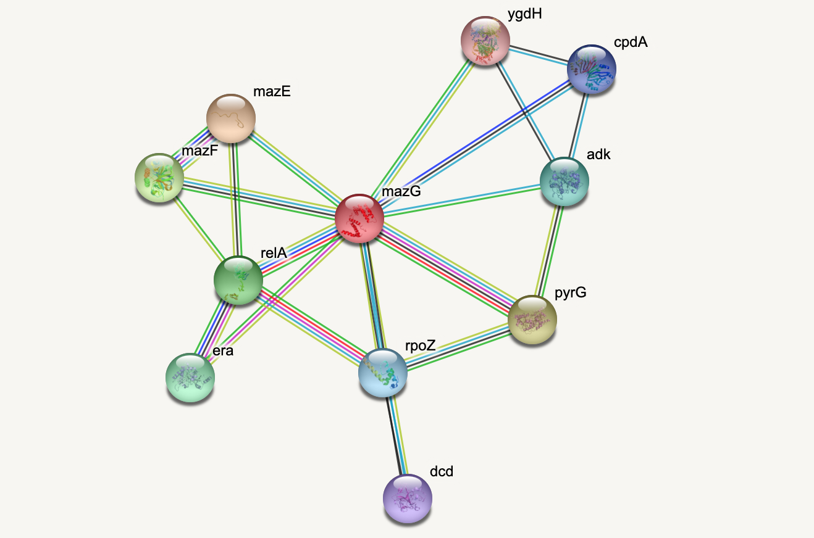

[**Download Chapter pdf**]()

[**Download Chapter notebook (ipynb)**]()

[<span style="color: rgb(255, 0, 0);">**Mandatory Lesson Feedback Survey**</span>](https://docs.google.com/forms/d/e/1FAIpQLSdr0capF7jloJhPH3Pki1B3LZoKOG16poOpuVJ7SL2LkwLHQA/viewform?pli=1)


::::::::::::::::::::::::::::::::::::: questions 

- 
-
-

::::::::::::::::::::::::::::::::::::::::::::::::

::::::::::::::::::::::::::::::::::::: objectives

-
-
-
::::::::::::::::::::::::::::::::::::::::::::::::


:::::::::::::::::: prereq 

## Prerequisites

- [Basic Python]()
- [Basic Matplotlib]()

::::::::::::::::::


## Example: Protein-protein interactions

Protein-protein interactions (PPIs) ([PLoS: Protein–Protein Interactions](https://www.ncbi.nlm.nih.gov/pmc/articles/PMC2891586/)) refer to specific and function physical contact between proteins in vivo. Interactions may be dependant on biological context, organism, definition of interaction, and many other factors. An example of some PPIs can be seen below.



PPIs may be visualised as a network, in order to give greater context to the protein interactions, and see how changes to one protein may affect another protein several steps removed. A PPI network can be modelled via a graph in which the nodes represent the proteins and the edges represent interactions; an edge from node A to node B indicates protein B interacts with protein A. The diagram above shows the PPI network centred around the protein $mazG$ in *Escherichia coli K12 MG1655*. This is part of a toxin-antitoxin system. These systems generally encode pairs of *toxin* and inhibitory *antitoxin* proteins, are transmitted by plasmids, and likely serve several biological functions including stress tolerance and genome stabilisation. $mazG$ regulates the type II toxin-antitoxin system shown in this network, where $mazF$ is the toxin and $mazE$ is the antitoxin. More details on the proteins in this network can be seen on STRING-DB ([STRING-DB: mazG in E. coli](https://version-11-0b.string-db.org/cgi/network?networkId=b6lw5pU2DeQm))

At the end of the example we are going to use Python to draw this PPI network, before this however, we shall begin with some small examples to familiarise you with the elements and properties of small graphs. 


## An Introduction to Networks

### What is a graph?

A graph is an object in mathematics for describing relationships between objects. An simple example of a visual representation of a graph is given below.


This graph contains three objects or **nodes** or **vertices** and three links called **edges** or **arcs** between the nodes. Graphs can be used to represent networks.

For a formal definition of a graph see, e.g. the [Wikipedia entry](https://en.wikipedia.org/wiki/Graph_theory).

If the above graph represented a protein-protein interaction network then the nodes would represent three proteins and the edges represent interactions between them.

To add further proteins, you add new nodes to the network. To include further dependencies, you add edges.

We shall see below how we can build and modify such a network, and how to represent networks in Python.

### NetworkX

[__NetworkX__](https://networkx.org) is a Python package for the creation, manipulation, and study of the structure, dynamics, and functions of complex networks.

To use NetworkX and visualise your networks, you can import the whole package.

```{r setup, include=FALSE}
knitr::opts_chunk$set(echo = TRUE)
library(reticulate)
## use_python("/usr/local/bin/python3.10")
## install_python(version = version)
# version = "3.10.2"
# virtualenv_create("r-env", python_version = version)
# Requirement already satisfied: setuptools in /Users/sabaferdous/.virtualenvs/r-env/lib/python3.10/site-packages (58.1.0)
# virtualenv_install(envname = "r-env", "pandas", "matplotlib", "sklearn")
use_virtualenv("r-env")
```

```{python}
import networkx as nx
from matplotlib.pyplot import show
```

### Nodes and Edges

Nodes are a basic unit of data, and are linked to other nodes by edges, which show the way(s) in which the nodes are related. In NetworkX, a range of Python objects, including numbers, text strings, and other networks can be nodes.

Let's start by creating an empty graph object and then add some nodes to it.

```{python, results="hold"}
firstGraph = nx.Graph()

firstGraph.add_node('Node A')
firstGraph.add_node('Node B')
firstGraph.add_node('Node C')

print(type(firstGraph))
print('')
print(firstGraph.nodes)
print('')
```

We have created a graph called _firstGraph_, added three nodes, and then printed the type of object and a list of the nodes in this graph. So far, these nodes have no relationship to each other? To specify relationships (representing e.g. interactions) we can add edges to show how the nodes are connected.

```{python}
firstGraph.add_edge('Node A', 'Node B')
firstGraph.add_edge('Node A', 'Node C')
firstGraph.add_edge('Node B', 'Node C')

print(firstGraph.edges)
```

Here we created edges between Nodes A and B, A and C, and B and C, and printed a list of these edges. We can also get a summary of how many nodes and edges out graph currently has. At this stage, our graph should have three nodes and three edges. Here is how to check that in NetworkX.

```{python}
firstGraph.number_of_nodes()
```

```{python}
firstGraph.number_of_edges()
```

### Visualising networks

We have a basic graph  called `firstGraph`, so let's visualise it. In NetworkX, we can use function `draw`.

```{python}
nx.draw(firstGraph)
show()
```

With te default settings, we get a triangle with three blue nodes in the corners, connected by three lines. There are no arrowheads on the lines, the network is therefore referred to as _undirected_.

To make the graph less abstract, we can add labels to the nodes. This is done setting up a dictionary where we use as `keys` the names given to the nodes when they were set up. The single `value` is the label to be used for the display.

Through NetworkX we can also dictate the way the nodes are positioned by setting a _layout_. There are many options, and we're using the spiral layout as an example. For a list of layout options, please check the [NetworkX documentation](https://networkx.org/documentation/stable/reference/drawing.html#module-networkx.drawing.layout).

```{python}
firstGraphLayout = nx.spiral_layout(firstGraph)

firstGraphLabels = {
#   key     : value
    'Node A': 'A',
    'Node B': 'B',
    'Node C': 'C',
}

nx.draw(firstGraph, firstGraphLayout, 
        labels=firstGraphLabels)

show()
```
Note that we use `draw` providing the graph object followed by the (optional) layout as positional arguments. Other keyword arguments (here the labels) are then added, separated by comma.

> __Saving Figures:__ If you want to save a network graph to a file, you can use function `savefig`. Here is an example that will save the figure in the folder with the code. 

```{python}
from matplotlib.pyplot import savefig
```

```{python}
firstGraphLayout = nx.spiral_layout(firstGraph)

firstGraphLabels = {
    'Node A': 'A',
    'Node B': 'B',
    'Node C': 'C',
}

nx.draw(firstGraph, firstGraphLayout, 
        labels=firstGraphLabels)

savefig('my_network.png', format='png');

show()
```

You may want to alter the appearance of your graph in different ways. Let's say you want the nodes to be red, you achieve this by using the keyword argument `node_color`.

```{python}
nx.draw(firstGraph, firstGraphLayout, 
        labels=firstGraphLabels, 
        node_color='r')

show()
```

Note that, as always, the spelling is the US version, 'color'.

## Creating a Network Matrix

A generic way to define graphs is via a two dimensional array known as the **network matrix** or **adjacency matrix**. We won't go into the details of matrices here but will just show you how to create them in Python. 

For our purpose a matrix is a collection of numbers. Let us start by creating a matrix that contains only zeroes. A very easy way to create a matrix with zeroes in Python is using `zeros` from Numpy. The number of network nodes is equal to the number of rows and columns in the array.

```{python}
from numpy import zeros

nodes = 3

my_matrix = zeros((nodes, nodes))

print(my_matrix)
```

We have given the `zeros` function two arguments, 3 and 3, and it has created an array of 9 numbers (all of value 0) arranged into 3 rows and 3 columns. This is a **square matrix** because the number of rows is equal to the number of columns. We say that this matrix is of dimension $3\times 3$. 

To check the dimensions of a Numpy array, you can use `shape`. Since in the above code we have assigned the matrix to the variable `my_matrix` we can call it as follows.

```{python}
my_matrix.shape
```


Note that `shape` does not take arguments. It returns the dimensions of the matrix as an array of length 2; the first element is the number of rows and the second element is the number of columns.

We can now access each element of `my_matrix` and change its value. To change the element in the second row and the third column we use the syntax `my_matrix[1, 2]` where we first specify the row index and the column index second, separated by a comma. 

```{python}
my_matrix[2, 0] = 1
my_matrix[1, 0] = 1

print(my_matrix)
```

::::::::::::::::::::::::::::::: challenge 

## Do it Yourself

Create a 4x4 matrix called $n$ and set the elements $n_{0,1}=1$, $n_{1,2}=1$ and $n_{1,3}=1$.
	
::::::::::::::::: solution
	
## DIY ANSWER

```{python}
n = zeros((4,4))

n[0, 1] = 1 
n[1, 2] = 1 
n[1, 3] = 1 

print(n)
```

:::::::::::::::::

::::::::::::::::::::::::::::::: 

## Representing graphs

Now we shall see how a $3 \times 3$ square matrix can represent a graph with three nodes which we call $A$, $B$ and $C$. Consider the following table where we have taken the matrix elements and labelled both the rows and the columns $A,B$ and $C$.


This matrix can represent a graph with three nodes. The value of 1 in the first row and the second column indicates that there is an **edge** from node $A$ to node $B$. Therefore the row position indicates the node that an edge emanates from and the column position indicates the node that the edge ends on. 

We can see that there are four edges in this graph:
* from node $A$ to node $B$
* from node $B$ to node $A$
* from node $B$ to node $C$
* from node $C$ to node $A$


::::::::::::::::::::::::::::::: challenge 

## Do it Yourself

For the matrix, $n$, created in Exercise 1.1, is a network matrix representing a graph, use code to check the number of nodes and edges. 
	
::::::::::::::::: solution
	
## DIY ANSWER

```
The graph has four nodes and three edges. 
$n_{0,1} $ or $n[0][1]$ is an edge from node 0 to node 1.
$n_{1,2}$ or $n[1][2]$ is an edge from node 1 to node 2.
$n_{1,3}$ or $n[1][3]$ is an edge from node 1 to node 3.
```

:::::::::::::::::

::::::::::::::::::::::::::::::: 

## Different Layouts for Visualisation

Now that we know how to create a matrix which can represent the graph, we want to know what the graph coming from this matrix looks like. 

First, we set up the network (or: adjacency) matrix in the above table from scratch. Then we use NetworkX function `from_numpy_matrix` to turn our matrix into a NetworkX Graph object called `new_graph`. We set the layout to a spiral layout (as we did before) and then draw the graph. 

```{python}
new_matrix = zeros((3,3))

new_matrix[1, 2] = 1 
new_matrix[2, 0] = 1 
new_matrix[0, 1] = 1 
new_matrix[1, 0] = 1 

new_graph = nx.from_numpy_matrix(new_matrix)

newLayout = nx.spiral_layout(new_graph)

nx.draw(new_graph, newLayout)

show()

```

We haven't specified labels. We can specify the labels using a dictionary. Let us first see how the nodes are stored to find their Python names. 

```{python}
list(new_graph.nodes)
```

By default, the nodes are given the names of their indices. We can refer to these indices and assign labels.

```{python}
newLabels = {
# key : value
    0: 'A',
    1: 'B',
    2: 'C',
}
```

We can now draw the graph again, and specify the new labels A, B, and C.

```{python}
nx.draw(new_graph, newLayout,
        labels=newLabels)
        
show()       
```

There are many different options available for drawing graphs. Use `help(nx.draw)` to get a description of the options available for the graph as a whole, the nodes and the edges. 

We shall first experiment with the graph layout. Converting a mathematical description of a graph, ie an adjacency matrix, to a graphical description is a difficult problem, especially for large graphs. The algorithms that perform this operation are known as graph layout algorithms and NetworkX has over five different ones. We used `spiral_layout` to produce the drawing above. Further specifications can be made within each layout, and you can access the details with $help$.

Some graph layout algorithms have a random component such as the initial position of the nodes. This means that different realisations of the layouts will not be identical. 

::::::::::::::::::::::::::::::: challenge 

## Do it Yourself

1. Use the graph layout algorithm called `shell_layout` to plot `new_graph`.

2. Draw the graph with a third layout algorithm called `random_layout`. Execute the code to  draw the graph several times.

3. Draw the graph from the matrix $n$, created in Exercise 1.1 with the layout algorithm `spectral_layout`. Give the nodes the names $V$, $X$, $Y$ and $Z$.

	
::::::::::::::::: solution
	
### Q1

```{python}
newLayout = nx.shell_layout(new_graph)

nx.draw(new_graph, newLayout,
        labels=newLabels)

show()
```

:::::::::::::::::

::::::::::::::::: solution
	
### Q2

```{python}
newLayout = nx.random_layout(new_graph)

nx.draw(new_graph, newLayout)

show()
# The layout of this graph changes each time you run the code.
```

:::::::::::::::::


::::::::::::::::: solution
	
### Q3

```{python}
n = zeros((4,4))

n[0, 1] = 1 
n[1, 2] = 1 
n[1, 3] = 1 

new = nx.from_numpy_matrix(n)

newLabels = {
    0: 'V',
    1: 'X',
    2: 'Y',
    3: 'Z',
}

newLayout = nx.spectral_layout(new)

nx.draw(new, newLayout, 
        labels=newLabels)
        
show()        
```

:::::::::::::::::

::::::::::::::::::::::::::::::: 

## Customising nodes and edges

Now we are going to look at some ways to access and change some properties, or attributes, of the nodes in the graph. We have already changed the node colour from blue to red. Let's say we want to change the colour to gold (for a list of available names see [matplotlib: plot colours](https://matplotlib.org/3.1.0/gallery/color/named_colors.html)), change the node shapes to hexagons ([matplotlib: node shapes](https://matplotlib.org/3.1.1/api/markers_api.html)), and increase the node size. This plot will vary each time you run it, due to the layout algorithm.

```{python}
new_graph = nx.from_numpy_matrix(new_matrix)

newLayout = nx.random_layout(new_graph)

newLabels = {
    0: 'A',
    1: 'B',
    2: 'C',
}

nx.draw(new_graph, newLayout,
        labels=newLabels, 
        node_color='gold', 
        node_shape="H", 
        node_size=2000)
show()

```

You may want to add another node, but only have it connected to one of the existing nodes. Here we add a new node, which is the number 3 because Python indexes from zero. You can print the nodes, and see that you now have four. 

```{python}
new_graph.add_node(3)

print(new_graph.nodes)
```

We may want to set a new layout for this graph and update the labels to call the new node 'D'. You will see that the new node is not connected to any other node, because we have not specified how it relates to the other nodes.

```{python}
newLayout = nx.random_layout(new_graph)
newLabels = {
    0: 'A',
    1: 'B',
    2: 'C',
    3: 'D'
}

nx.draw(new_graph, newLayout,
        labels=newLabels, 
        node_color='gold', 
        node_shape="H", 
        node_size=800);

show()
```

We discussed above changing the colour of the nodes in our graph. There are several ways you can specify colour in Python ([matplotlib: node shapes](https://matplotlib.org/3.1.1/api/markers_api.html)). The RGB format is one of these methods used for specifying a colour. The colour is specified via an array of length 3 containing the relative amounts of Red, Green and Blue. Red is specified via $[[1, 0, 0]]$, blue via $[[0, 0, 1]]$ and green via $[[0, 1, 0]]$. As special cases, $[[0, 0, 0]]$ will give you black, and $[[1, 1, 1]]$ will give white. 

::::::::::::::::::::::::::::::: challenge 

## Do it Yourself

Add an edge to the network to connect the isolated node D to e.g. node A. 

	
::::::::::::::::: solution
	
## DIY ANSWER

```{python}
new_graph.add_edge(3, 0)

nx.draw(new_graph, newLayout,
        labels=newLabels, 
        node_color='gold', 
        node_shape="H", 
        node_size=800);

show()        
```

:::::::::::::::::

::::::::::::::::::::::::::::::: 

Instead of altering individual elements of a matrix with zeroes (as we have done above) you can also create a graph directly from a Numpy array array. You set up a nested list and convert it to a Numpy array using `array`.

```{python}
from numpy import array

matrixFromArray =  array([[0, 1, 0, 0], 
                          [0, 1, 0, 1], 
                          [1, 0, 1, 1], 
                          [1, 0, 1, 0]])

my_graph = nx.from_numpy_matrix(matrixFromArray)

my_graphLayout = nx.spring_layout(my_graph)

nx.draw(my_graph, my_graphLayout)

show()
```

::::::::::::::::::::::::::::::: challenge 

## Do it Yourself

Set all the nodes in this graph to turquoise diamonds. By turquoise we mean the RGB colour $[[0, 1, 1]]$
	
::::::::::::::::: solution
	
## DIY ANSWER

```{python}
nx.draw(my_graph, newLayout,
        labels=newLabels,
        node_color=[[0, 1, 1]], 
        node_shape="D", 
        node_size=800)
show()
```

:::::::::::::::::

::::::::::::::::::::::::::::::: 

## Directed graphs

So far, we have been working with )_undirected_ graphs: all the edges between the nodes were independent of the direction in which they were set up and thus represented as lines without arrowheads. Such networks are also referred to as _bidirectional_. For some systems, such as biochemical reactions or the food web we looked at earlier, a _directed_ graph is more suited, and gives us more detail on the relationships represented in the network.

In NetworkX, directed graphs are handled using the class `DiGraph`. We can make a simple DiGraph by importing a matrix as above, but specifying that is is a directed graph.

```{python}
directedMatrix =  array([[0, 1, 0, 1],
                         [0, 1, 1, 0],
                         [0, 0, 0, 1],
                         [1, 1, 0, 0]])
    
directed = nx.from_numpy_matrix(directedMatrix, create_using=nx.DiGraph)

directedLayout = nx.spiral_layout(directed)

directedLabels = {
    0: 'A',
    1: 'B',
    2: 'C',
    3: 'D',
}

nx.draw(directed, directedLayout, 
        labels=directedLabels)

show()
```

You'll be able to see in this graph that the edges now have arrow tips indicating the direction of the edge. The edge between node A and node D has an arrow tip on each end, indicating that edge is bidirectional. Node B is connected to itself.

In NetworkX convention an edge is set up in a network matrix in the direction row $\rightarrow$ column. Thus, a given row tells us which edges leave the node with that row number. A given column tells us which edges arrive at the node with that column number. Thus the bidirectional edge between node A and node D is given by directedMatrix$_{3,0}$ and directedMatrix$_{0,3}$ both being equal to 1. 

An entry on the diagonal, directedMatrix$_{1,1}$,  is used for self-connection of node B.

::::::::::::::::::::::::::::::: challenge 

## Do it Yourself


Change  directedMatrix$_{3,2}$  to 1. What does this change about the graph?	
	
::::::::::::::::: solution
	
## DIY ANSWER

```{python}
directedMatrix =  array([[0, 1, 0, 1],
                         [0, 1, 1, 0],
                         [0, 0, 0, 1],
                         [1, 1, 0, 0]])

directedMatrix[3, 2] = 1 
    
directed = nx.from_numpy_matrix(directedMatrix, create_using=nx.DiGraph)

directedLayout = nx.spiral_layout(directed)

directedLabels = {
    0: 'A',
    1: 'B',
    2: 'C',
    3: 'D',
}

nx.draw(directed, directedLayout, 
        labels=directedLabels)
show()
```

:::::::::::::::::

::::::::::::::::::::::::::::::: 

## Bipartite graphs

Bipartite graphs are another graph type supported by NetworkX. These are networks which are made up of two groups of nodes which connect to nodes in the other group, but not with other nodes in the same group. Some ecological, biomedical, and epidemiological networks may be represented by bipartite networks. In NetworkX there is not a specific bipartite class of graphs, but both the undirected and directed methods we have used earlier may be used to represent bipartite graphs. However, it is recommend to add an attribute to the nodes in your two groups to help you differentiate them. The convention in NetworkX is to assign one group of nodes an attribute of 0, and the other an attribute of 1.

```{python}
from networkx.algorithms import bipartite

myBipartite = nx.Graph()

# Add nodes with the node attribute "bipartite"
myBipartite.add_nodes_from(['h', 'i', 'j', 'k'], bipartite=0)
myBipartite.add_nodes_from(['q', 'r', 's', 't'], bipartite=1)

# Add edges only between nodes of opposite node sets
myBipartite.add_edges_from([('h', 'q'), 
                            ('h', 'r'), 
                            ('i', 'r'), 
                            ('i', 's'), 
                            ('j', 's'), 
                            ('k', 'q'), 
                            ('h', 't')])
```

Here, we set up a bipartite network with 8 nodes. The 0 group has nodes $'h', 'i', 'j', 'k'$, and the 1 group has nodes $'q', 'r', 's', 't'$. The edges we have specified link nodes from the two groups with each other, but not to any nodes within their own group. NetworkX has a function to check your nodes are connected. 

```{python}
nx.is_connected(myBipartite)
```

This will return either true or false. Be cautious though, this only tests for connection, not whether your graph is truly bipartite. You can use the function `nx.is_bipartite(myBipartite)` from `networkx.algorithms` to test whether your network is bipartite. It will return `TRUE` if your NetworkX object is bipartite.

```{python}
bipartite.is_bipartite(myBipartite)
```

We can now plot the bipartite graph, using the layout of your choice. if we include the term $with\_labels = True$ as we draw the graph, the node names we set earlier become the node labels.

```{python}
myBipartiteLayout = nx.spiral_layout(myBipartite)

nx.draw(myBipartite, myBipartiteLayout,
        node_size=2000,
        with_labels=True)
        
show()        
```

This might not looks like a a bipartite network! But if you check the edges you set up earlier, this is bipartite as no node has an edge with another node in each group. If we want to to look more like a classic bipartite network, we can use the attributes we set up earlier and the module $networkx.algorithms$ to make a custom layout and more clearly visualise the bipartite nature of this graph.

```{python}
groupzero = nx.bipartite.sets(myBipartite)[0]

bipartitePos = nx.bipartite_layout(myBipartite, groupzero)

nx.draw(myBipartite, bipartitePos, 
        node_size=2000, 
        with_labels = True)

show()
```

Using the bipartite convention of giving one group of nodes the attribute 0 and the other 1 means that you can use this to change other aspects of your graph, such as colour. Here, we use the attributes of the nodes to assign a colour to each group of nodes. The colour list can then be included in the plot.

```{python}
color_dictionary = {0: 'gold', 1: 'lavender'}

color_list = list()

for attr in myBipartite.nodes.data('bipartite'):
    
    color_list.append(color_dictionary[attr[1]])

print(color_list)
```

```{python}
nx.draw(myBipartite, bipartitePos, 
        node_size=2000, 
        font_size=20,
        with_labels=True, 
        node_color=color_list) 
        
show()        
```

A readable introduction to bipartite networks and their application to gene-disease networks can be found in section 2.7 of the online textbook [Network Science by A.L. Barabási](http://networksciencebook.com/chapter/2#bipartite-networks).


## Exercises

:::::::::::::::::::::::::::::::::::::::: challenge
## End of chapter Exercises

# Assignment: the Toxin-Antitoxin Network

Use code to create the (undirected) toxin-antitoxin PPI network given at the start of this example. Experiment with the different layout algorithms, the node colour and shape, and the edge color.

Hint:

* Using pen and paper, draw a diagram of the PPI network.
* Decide on the ordering of the nodes. I chose to start with the centre node, and then number them in an anticlockwise direction.  (**Hint:** There are 11 nodes in total.)
* Label your pen and paper diagram with the node numbers.
* Work out all the edges in the graph. Note the numbers of the node at the start of the edge and the node at the end of the edge. (**Hint:** There are 20 edges in total.)
* Define a $11 \times 11$ matrix in Python using the Numpy `zeros` function.
* For each edge, set the corresponding entry in the matrix to 1 (start node number corresponds to row number and end node number corresponds to column number in the adjacency matrix).
* Define a cell array containing your node names and create a NetworkX object.
* Experiment with the layout, colours, node shapes etc.

Remember to use the Python documentation, e.g. using `help()` if you have problems (or alternatively use a search engine such as Google).

To save the graph as an image file, use `savefig` as we did earlier. 

::::::::::::::::::::: solution

## Please check these solutions only after submitting the assignments.


```{python}
import networkx as nx

from numpy import zeros

ppi = zeros((11,11))

ppiLabels = {
    0: 'mazG',
    1: 'mazE',
    2: 'mazF',
    3: 'relA',
    4: 'era',
    5: 'rpo2',
    6: 'dcd',
    7: 'pyrG',
    8: 'adk',
    9: 'cpdA',
    10: 'ygdH',   
}

ppi[0, 1] = 1 
ppi[2, 1] = 1
ppi[0, 2] = 1
ppi[2, 3] = 1
ppi[0, 3] = 1
ppi[1, 3] = 1
ppi[4, 3] = 1
ppi[5, 3] = 1
ppi[4, 0] = 1
ppi[5, 0] = 1
ppi[5, 6] = 1
ppi[5, 7] = 1
ppi[0, 7] = 1
ppi[8, 7] = 1
ppi[8, 0] = 1
ppi[8, 9] = 1
ppi[8, 10] = 1
ppi[0, 9] = 1
ppi[9, 10] = 1
ppi[0, 10] = 1

ppiGraph = nx.from_numpy_matrix(ppi)

ppiLayout = nx.spring_layout(ppiGraph)

nx.draw(ppiGraph, ppiLayout, 
              labels=ppiLabels, 
              node_size=1800, 
              node_color='lightseagreen', 
              node_shape="8")
              
show()              
```

::::::::::::::::::::: 

::::::::::::::::::::::::::::::::::::::::


::::::::::::::::::::::::::::::::::::: keypoints 

-
-
-

:::::::::::::::::::::::::::::::

[r-markdown]: https://rmarkdown.rstudio.com/
