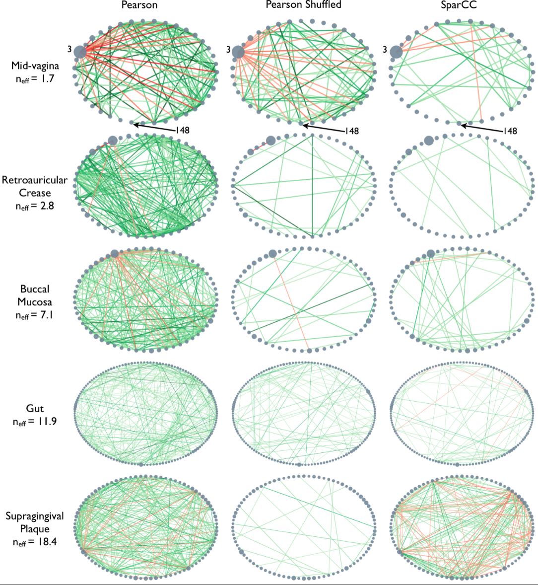

[**Download Chapter pdf**](03-networks_3.md.pdf)

[**Download Chapter notebook (ipynb)**](03-networks_3.ipynb)

[<span style="color: rgb(255, 0, 0);">**Mandatory Lesson Feedback Survey**</span>](https://docs.google.com/forms/d/e/1FAIpQLSdr0capF7jloJhPH3Pki1B3LZoKOG16poOpuVJ7SL2LkwLHQA/viewform?pli=1)


::::::::::::::::::::::::::::::::::::: questions 

- What are different ways of importing data in NetworkX?
- What are the common file import error?
- How to troubleshoot the import errors?

::::::::::::::::::::::::::::::::::::::::::::::::

::::::::::::::::::::::::::::::::::::: objectives

- Reviewing data import 
- Understanding troubleshooting of common errors in data import
- Applying network concepts to real-world datasets

::::::::::::::::::::::::::::::::::::::::::::::::


:::::::::::::::::: prereq 

## Prerequisites

- [Networks - Part 1](01-networks_1.Rmd)
- [Networks - Part 2](02-networks_2.Rmd)
::::::::::::::::::

```{r setup, include=FALSE}
knitr::opts_chunk$set(echo = TRUE)
library(reticulate)
use_virtualenv("r-env")
##use_python("/Users/sabaferdous/envL2D/bin/python3")
```


```{python}
import networkx as nx

from pandas import read_csv

from numpy import mean, fill_diagonal
from numpy.random import randint

from matplotlib.pyplot import subplots, show
```

## Importing data into NetworkX
<p style='text-align: justify;'> 
In the previous two lessons we have looked at the basics of NetworkX, created some networks, analysed various properties of networks, and practised these techniques with the pre-prepared _C. elegans_ dataset. If you want to use NetworkX with data of your own, you'll need to import your data in a compatible way. Specifically, you need to be able to import data from different original data formats.
</p>

### **CSV Format**

'.csv' indicates a very common file format, [comma separated values](https://en.wikipedia.org/wiki/Comma-separated_values). We used it in the previous lesson to import the simplified *C. elegans* neuronal network.

<p style='text-align: justify;'>
The network data 'celegans131matrix_50.csv' is simply a large adjacency matrix of 0s and 1s, with no further information. The 'celegans131labels_50.csv' file contains the list of neuron names, which we used to label the nodes. We'll have a look in more detail at how this import works. We use Pandas functions as a simple way to import a CSV file. (There are of course other ways.)
</p>

Here is the import of the data for the first 50 neurons.

```{python}
neurons=read_csv('data/celegans131matrix_50.csv', header=None, dtype = "int")

neurons=neurons.to_numpy()

print(len(neurons))
```
<p style='text-align: justify;'>
We import the CSV network file as before. We specify with a keyword argument that there is no header, otherwise the first line in the file will be assumed to be a header and not parsed (handled) in the same way as the rest of the data. We also specify that the adjacency matrix is of data type `int`. (This does not necessarily have to be the case, see the Microbiome network below.) We then convert the `neurons` dataframe to a Numpy array. The `neuron_Names` can be imported in a similar way. They will need to be converted from a dataframe to a dictionary:
</p>

```{python}
neuron_Names = read_csv('data/celegans131labels_50.csv', header=None)

neuronNames = neuron_Names.to_dict()

neuronLabels = neuronNames[0]

print(neuronLabels)
```

<p style='text-align: justify;'>
Dictionaries associate keys with values.  You may remember we previously created a dictionary to assign labels to nodes. Here we convert the `neuron_Names` dataframe into a dictionary the neuron (node) indices are the keys and the corresponding neuron (node) names are the values. As the function `to_dict` wraps the dictionary within a dictionary, we obtain the plain labels dictionary by referring to index '0'. 
</p>

Now we can create a graph, specify a layout, and plot the network.

```{python}
neuronGraph = nx.from_numpy_matrix(neurons)   

neuronLayout = nx.random_layout(neuronGraph, seed=123)

nx.draw(neuronGraph, neuronLayout, 
        node_size=1000,
        labels = neuronLabels)

show()
```

<p style='text-align: justify;'>
In this particular case we also have other metadata that can be used for visualisation and analysis. In our case, we have the file 'celegans131positions_50.csv' - which contains information on how the nodes relate to each other in 2-D space. We can include this information to replace the layout.
</p>

```{python}
neuronPos = read_csv('data/celegans131positions_50.csv', header=None)

neuronPositions = neuronPos.values

nx.draw(neuronGraph, neuronPositions,
        node_size=1000,
        labels = neuronLabels)
        
show()        
```

The two BAG nodes to the right of the display are the (right and left) [sensory neurons used to monitor oxygen and carbon dioxide](https://www.wormatlas.org/neurons/Individual%20Neurons/BAGframeset.html).

::::::::::::::::::::::::::::::: challenge 

## Do it Yourself

Find the nodes indices of the sensory neurons named 'BAGL' and 'BAGR'.

::::::::::::::::: solution
	
## DIY ANSWER
```{python}
for ind, name in enumerate(neuronLabels.values()):
    
    if 'BAG' in name:
        
        print(ind, neuronLabels[ind])
```

:::::::::::::::::

::::::::::::::::::::::::::::::: 


### **Networks Repository: List of Edges**
<p style='text-align: justify;'>
Network files in the [Network Repository](http://networkrepository.com/index.php) are sourced from publications and provided in the '.edges' format. These are plain text files. Let's have a look at the network of a mouse visual cortex. You can find this at [MOUSE-VISUAL-CORTEX-1](http://networkrepository.com/bn-mouse-visual-cortex-1.php). You can either download the zip file from the database or use the file provided for this Lesson. 
</p>
<p style='text-align: justify;'>
Place the file 'bn-mouse_visual-cortex_1.edges' in your working directory. It can be helpful to first open it in any text-editor to see what the data look like. In this case, it is a list of two numbers per row, separated by a space. This is the list of (directed) edges. The first number indicating 'from', the second 'to'. Nodes are not given explicitly but will be inferred from the indices. 
</p>
Being a list of edges, we can import it into NetworkX as an _edgelist_, specifying that the nodes are given as integers. The result is a standard graph object which we can plot using `draw`.

```{python}
MouseCortex = nx.read_edgelist("data/bn-mouse_visual-cortex_1.edges", nodetype=int)

MouseCortexLayout = nx.random_layout(MouseCortex, seed=111)

nx.draw(MouseCortex, MouseCortexLayout,
        node_size=1000,
        node_color='r',
        with_labels=True)
        
show()        
```

To interpret the network, you can check it against the source, [MOUSE-VISUAL-CORTEX-1](http://networkrepository.com/bn-mouse-visual-cortex-1.php).

::::::::::::::::::::::::::::::: challenge 

## Do it Yourself

Network Repository provides some summary data on all their networks. Obtain the (i) number of nodes, (ii) number of edges, and (iii) average clustering coefficient and compare it to the data in [their network summary](https://networkrepository.com/bn-mouse-visual-cortex-1.php).

	
	
::::::::::::::::: solution
	
## DIY ANSWER
```{python, results = "hold"}
print('Number of nodes:', len(MouseCortex))
print('')
print('Number of edges:', len(MouseCortex.edges))
print('')
print('Average clustering coefficient:', mean(list(nx.clustering(MouseCortex).values())))
```

:::::::::::::::::

::::::::::::::::::::::::::::::: 


### **JSON Format**
<p style='text-align: justify;'>
[JSON (JavaScript Object Notation)](https://en.wikipedia.org/wiki/JSON) is an open standard file format which is language independent and widely used. Here is an example code to import and display the network that contains [co-occurances of characters in Victor Hugo's novel 'Les Misérables'](http://konect.cc/networks/moreno_lesmis/).
</p>

```{python}
import json

with open('data/miserables.json', 'r') as myfile:
    
    data=myfile.read()
    

miserables = json.loads(data)

miserablesNetwork = nx.json_graph.node_link_graph(miserables)

miserablesNetworkLayout = nx.circular_layout(miserablesNetwork)

fig, ax = subplots(figsize=(12,12))

nx.draw(miserablesNetwork, miserablesNetworkLayout,
        node_size=3000,
        with_labels=True)

fig.tight_layout()

show()
```

As you can see, the 'data' variable contains the character names as node names. 

If you are curious, open the file with a text editor and check the entries.

E.g. our file starts like this:

```
{

  "nodes": [

    {"id": "Myriel", "group": 1},
```
<p style='text-align: justify;'>
As you can see, the style with curly brackets and colons immediately suggests the use of associative arrays (dictionary) once the data are within Python. The function `node_link_graph` provides an interface to handle the data as a NetworkX graph.
</p>
<p style='text-align: justify;'>
There are many other files formats that contain network data. For a list of NetworkX functions that allow import from and export to other file formats, see [Reading and writing graphs](http://localhost:8888/lab/tree/Dropbox/Lessons_NetworkX).
</p>

## NetworkX troubleshooting

There are many errors that may occur in the context of dealing with network data.  We exemplify some common problems, to help find out how to diagnose and solve them. 

### **FileNotFoundError**

Here we try to import a CSV file which contains an adjacency matrix. We have checked that the file is present in the working directory. 

```{python}
neurons = read_csv('data/celegans131mtrix_50.csv', header=None, dtype="float64")
```

::::::::::::::::::::::::::::::: challenge 

## Do it Yourself


What has gone wrong, and what is the solution?	
	
::::::::::::::::: solution
## DIY ANSWER
You'll see this error if something has gone wrong in the way you've instructed Python to find your file. This may be that you've mis-typed the file name, or the file isn't in your working directory. Here, the file is present in the working directory, but there's a typo in the file name.	

```{python}
neurons = read_csv('data/celegans131matrix_50.csv', header=None, dtype='int')
```

:::::::::::::::::

::::::::::::::::::::::::::::::: 

### **KeyError**

Here we generate a random adjacency matrix, specify how it should be plotted, and try to visualise it.

```{python, results = "hold"}
rm = randint(0, 2, size=(5, 5))

thisgraph = nx.from_numpy_matrix(rm)

thisgraphLayout = nx.spiral_layout(thisgraph)

thisgraphLabels = {
    0: 'A',
    1: 'B',
    2: 'C',
    3: 'D',
    4: 'E',
    5: 'F',
}

nx.draw(thisgraph, thisgraphLayout,
        labels=thisgraphLabels)
        
show()

```

::::::::::::::::::::::::::::::: challenge 

## Do it Yourself

 Why does the call of `draw` throw an error, and what is the solution?
	
::::::::::::::::: solution
## DIY ANSWER
If you look at the error message, it first flags **5: 'F',**, and ends with an error about labels. We've included too many node labels: 6 labels for five nodes. This is easily corrected by taking one label out.

```{python, results = "hold"}
rm = randint(0, 2, size=(5, 5))

thisgraph = nx.from_numpy_matrix(rm)

thisgraphLayout = nx.spiral_layout(thisgraph)

thisgraphLabels = {
    0: 'A',
    1: 'B',
    2: 'C',
    3: 'D',
    4: 'E',
}

nx.draw(thisgraph, thisgraphLayout, 
        node_size=1000,
        node_color='tomato',
        labels=thisgraphLabels)

show()
```
:::::::::::::::::

::::::::::::::::::::::::::::::: 

### **Graph is not bipartite**

Here we generate a bipartite graph, and try to plot it.

```{python, results = "hold"}
thisBipartite = nx.Graph()

# Add nodes with the node attribute "bipartite"
thisBipartite.add_nodes_from(['a', 'b', 'c', 'd', 'e', 'f'], bipartite=0)
thisBipartite.add_nodes_from(['m', 'n', 'o', 'p', 'q', 'r'], bipartite=1)

# Add edges only between nodes of opposite node sets
thisBipartite.add_edges_from([('a', 'm'), ('a', 'n'), 
                              ('b', 'n'), ('b', 'o'), 
                              ('c', 'o'), ('d', 'm'), 
                              ('a', 'p'), ('a', 'd'), 
                              ('f', 'p'), ('d', 'r'), 
                              ('a', 'q'), ('e', 'n')])
                              
```

```{python}
nx.is_connected(thisBipartite)

```

```{python, results = "hold"}
basegroup = nx.bipartite.sets(thisBipartite)[0]

bipartiteLayout = nx.bipartite_layout(thisBipartite, basegroup)

nx.draw(thisBipartite, bipartiteLayout, 
        node_size=2000, 
        with_labels=True)
show()
```

::::::::::::::::::::::::::::::: challenge 

## Do it Yourself


Why did this happen, what check can you do to avoid the problem, and how do you debug it?	
	
::::::::::::::::: solution
## DIY ANSWER
In this instance, the error message is very clear: you can't plot a graph with a bipartite layout if the graph isn't bipartite. This would have also been evident if I hadn't just checked that the graph was connected, but also that it was bipartite.

```{python}
nx.bipartite.is_bipartite(thisBipartite)
```

There is one edge connecting two nodes within one group. If we either remove that edge, or change one of the nodes to the other group, it will be bipartite.

```{python, results = "hold"}
thisBipartite = nx.Graph()

# Add nodes with the node attribute "bipartite"
thisBipartite.add_nodes_from(['a', 'b', 'c', 'd', 'e', 'f'], bipartite=0)
thisBipartite.add_nodes_from(['m', 'n', 'o', 'p', 'q', 'r'], bipartite=1)

# Add edges only between nodes of opposite node sets
thisBipartite.add_edges_from([('a', 'm'), ('a', 'n'), 
                              ('b', 'n'), ('b', 'o'), 
                              ('c', 'o'), ('d', 'm'), 
                              ('a', 'p'), ('a', 'n'), 
                              ('f', 'p'), ('d', 'r'), 
                              ('a', 'q'), ('e', 'n')])

```

```{python}
nx.bipartite.is_bipartite(thisBipartite)
```

```{python, results = "hold"}
basegroup = nx.bipartite.sets(thisBipartite)[0]

bipartiteLayout = nx.bipartite_layout(thisBipartite, basegroup)

fig = nx.draw(thisBipartite, bipartiteLayout, 
              node_size=2000, 
              node_color='tomato',
              node_shape='h',
              with_labels=True)
              
show()              
```

:::::::::::::::::

::::::::::::::::::::::::::::::: 

## Example: Full _C. elegans_ Neural Network

In the final part, we look at two publicly available networks that are of biomedical interest.

<p style='text-align: justify;'>
In this first example we return to data about the neuronal connections in _C. elegans_. This time we are using the full 277 neuron dataset, which includes  131 frontal neurons. For the original version of the data, go to the ([Dynamic Connectome](https://www.dynamic-connectome.org/)) website and select the Resources tab. 
</p>
<p style='text-align: justify;'>
The data in the $277 \times 277$ network matrix in the celegans277.zip file contain the connections between the 131 neurons in the frontal network, and 146 in the remainder or the network. If the connections _within_ each of these groups are severed, and the only remaining edges are between the two groups, this takes the form of a _bipartite graph_.
</p>
<p style='text-align: justify;'>
We have made available this modified version of the 277 neuron matrix, with no edges within the 131 or the 146 neuron group, see file 'celegans277matrix_bipartite.csv'. Note that bipartite networks do not work in NetworkX if any of the nodes are not connected. Also available for download is a list of neuron labels and spatial positions, files 'celegans277labels.csv' and 'celegans277positions.csv'.
</p>

```{python}
neurons = read_csv('data/celegans277matrix_bipartite.csv', header=None, dtype="int")

neuronNames = read_csv('data/celegans277labels.csv', header=None)

neurons= neurons.to_numpy()

neuronNames= neuronNames.to_dict()

myBipartiteLabels = neuronNames[0]

myBipartite = nx.from_numpy_matrix(neurons) 
```

<p style='text-align: justify;'>
Here we import the bipartite module from NetworkX, and then import the bipartite 277 neuron adjacency matrix and list of neuron names, in the same method as previously. Next, we use the bipartite convention in NetworkX to designate which nodes are in the $0$ group, and which are in the $1$ group. There are several ways to make a graph bipartite, here this is done by listing the node numbers of the 146 neurons and adding the attribute $'bipartite' = 0$, and listing the node numbers of the 131 neurons and adding the attribute $'bipartite' = 1$.
</p>

```{python}
myBipartite.add_nodes_from([
  0,   1,   2,   3,  13,  14,  17,  21,  22,  23,  24,  25,  
 26,  27,  28,  29,  30,  31,  32,  33,  34,  35,  36,  59,  
 60,  61,  66,  67,  69,  78,  79,  84,  85,  86,  87,  88,  
 89,  90,  91,  92,  93,  94,  95,  96,  97,  98,  99, 100, 
101, 102, 103, 104, 105, 106, 107, 108, 109, 110, 111, 112, 
125, 126, 133, 134, 135, 136, 137, 138, 139, 140, 141, 142, 
143, 144, 145, 146, 147, 148, 149, 150, 151, 152, 153, 154, 
155, 156, 157, 158, 159, 160, 161, 162, 170, 171, 172, 173, 
180, 195, 196, 203, 204, 205, 206, 207, 235, 236, 237, 238, 
239, 240, 241, 242, 243, 244, 245, 246, 247, 248, 249, 250, 
251, 252, 253, 254, 255, 256, 257, 258, 259, 260, 261, 262, 
263, 264, 265, 266, 267, 268, 269, 270, 271, 272, 273, 274, 
275, 276], bipartite=0)
                          
myBipartite.add_nodes_from([
  4,   5,   6,   7,   8,   9,  10,  11,  12,  15,  16, 
 18,  19,  20,  37,  38,  39,  40,  41,  42,  43,  44,  
 45,  46,  47,  48,  49,  50,  51,  52,  53,  54,  55,  
 56,  57,  58,  62,  63,  64,  65,  68,  70,  71,  72,  
 73,  74,  75,  76,  77,  80,  81,  82,  83, 113, 114, 
115, 116, 117, 118, 119, 120, 121, 122, 123, 124, 127, 
128, 129, 130, 131, 132, 163, 164, 165, 166, 167, 168, 
169, 174, 175, 176, 177, 178, 179, 181, 182, 183, 184, 
185, 186, 187, 188, 189, 190, 191, 192, 193, 194, 197, 
198, 199, 200, 201, 202, 208, 209, 210, 211, 212, 213, 
214, 215, 216, 217, 218, 219, 220, 221, 222, 223, 224,
225, 226, 227, 228, 229, 230, 231, 232, 233, 234], bipartite=1)
```

We can confirm that the network is bipartite.

```{python}
nx.bipartite.is_bipartite(myBipartite)
```

Next, we continue to use the bipartite convention introduced above to define the two bipartite groups, and set up a custom colouring list by group.

```{python, results = "hold"}
top = nx.bipartite.sets(myBipartite)[0]
pos = nx.bipartite_layout(myBipartite, top)

color_dictionary = {0:'gold',1:'lavender'}

color_list = [color_dictionary[i[1]] for i in myBipartite.nodes.data('bipartite')]

fig, ax = subplots(figsize=(10, 30))

nx.draw(myBipartite, pos, 
        node_size=1200, 
        labels=myBipartiteLabels, 
        node_color=color_list)
show()
```

The graph shows in a preliminary way that there are certain preferred connections between the two sets, in this case between the frontal group and the rest of the neurons.

::::::::::::::::::::::::::::::: challenge 

## Do it Yourself

Draw the bipartite neural network, coloured by group and positioned using the positional information from Dynamic Connectome in the file 'celegans277positions.csv'.
	
::::::::::::::::: solution
## DIY ANSWER
The 2D positions are contained in the file 'celegans277positions.csv'. After the import of the file, they can be extracted into a variable using `values`. The positions then need to replace the original layout values (called 'pos' above).

```{python}
neuronPos = read_csv('data/celegans277positions.csv', header=None)

neuronPositions = neuronPos.values

fig, ax = subplots(figsize=(10, 20))

nx.draw(myBipartite, neuronPositions, 
        node_size=3000, 
        labels=myBipartiteLabels, 
        node_color=color_list)

fig.tight_layout()

show()
```
:::::::::::::::::

::::::::::::::::::::::::::::::: 

## Example: Microbiome network
<p style='text-align: justify;'>
Microbiome data can be collected from a wide variety of environments, and is generally considered to be the bacterial, fungal, and viral components of a given environment. [Friedman and Alm (2012)](https://doi.org/10.1371/journal.pcbi.1002687) used data from the [Human Microbiome Project](https://www.nature.com/articles/nature11209) to calculate pairwise interaction correlations for each operational taxonomic unit (OTU). They then used Python and NetworkX to analyse and visualise several of these correlation datasets for each human body site. The challenge here is to extract network information about a graph from bivariate quantities like the correlation coefficient.
</p>


As the correlation data are open access, we can access them and derive the network.
<p style='text-align: justify;'>
Data are imported from text files. In this case, it is not a CSV file. Rather, the data are tab separated. We can adjust for this by specifying the keyword argument `delimiter` for tab. As the correlation coefficients are stored as decimal point numbers, we specify the keyword argument `dtype` as floating point 'float64'.
</p>
<p style='text-align: justify;'>
If you check the file, you will see that the first entry is '1.0'. This is because all self-correlations are (trivially) equal to one. We replace those diagonal values with 0 to avoid (nonsensical) self-connections in the network. </p>

```{python}
gutbact      = read_csv('data/Stool_sparse_adj_matrix.txt', 
                        header=None, delimiter='\t', dtype="float64")

gutbactNames = read_csv('data/Stool_sparse_matrix_names.txt', 
                        header=None)

gutbact= gutbact.to_numpy()

fill_diagonal(gutbact, 0)

gutbactNames= gutbactNames.to_dict()

gutbactLabels = gutbactNames[0]
```

```{python}
gutbactGraph = nx.from_numpy_matrix(gutbact)

gutbactLayout = nx.circular_layout(gutbactGraph)

fig, ax = subplots(figsize=(16,16))

nx.draw(gutbactGraph, gutbactLayout, 
        node_size=3000,
        node_color='r',
        labels=gutbactLabels)

show()        
```

<p style='text-align: justify;'>
This gives us the correlation network from the stool samples, with nodes labelled by the OTU number. However, this doesn't look much like the data from the article, partly as there are so many edges. The reason is that any number in the network matrix that is not equal to zero is interpreted as an edge. Thus, essentially the graph is fully connected. 
</p>

### **Functional Networks**
<p style='text-align: justify;'>
In the paper, Friedman and Alm (2012), the edges are taken from the correlations coefficients of the correlation matrix. I.e. they define the correlation matrix as a network matrix. But the entries of the correlation matrix are not 0s and 1s as we have used so far. Instead they are real numbers between -1 and 1.  What Friedman and Alm did to obtain meaningful edges was to pick a threshold correlation, e.g. $|cc| = 0.3$ and set any matrix entry with absolute value smaller than the threshold as 0. All other values are left as they are. Because anything non-zero will be interpreted as an edge, this means that they only plot edges where the correlation coefficient is greater than 0.3 or less than -0.3. Such networks are referred to as _functional networks. 
</p>
<p style='text-align: justify;'>
To threshold the correlation matrix in Python, we select matrix values between -0.3 and 0.3, and replace them with 0. Then we convert this thresholded network matrix to a graph and plot it. 
</p>

```{python}
from numpy import where, logical_and

threshold = 0.3

gutbact_threshold = where(logical_and(gutbact>=-threshold , gutbact<=threshold), 0, gutbact)

```

```{python}
gutbactGraph = nx.from_numpy_matrix(gutbact_threshold)

fig, ax = subplots(figsize=(16,16))

nx.draw(gutbactGraph, gutbactLayout, 
        node_size=3000,
        node_color='r',
        labels=gutbactLabels)
        
show()        
```

<p style='text-align: justify;'>
This network only displays edges where strong correlations were found and this is how Friedman and Alm obtained their graphs. Note that the network structure now is a function of the chosen threshold. Smaller thresholds yield more edges, higher thresholds fewer edges. Choosing the right threshold may be difficult and needs further thought. 
</p>
<p style='text-align: justify;'>
The creation of networks from functional data opens a wide field of research: _any_ interrelation matrix obtained with whatever metric can be interpreted as a network matrix and converted into a graph. As an example, see Figure 1 in [The Brain as a Complex System: Using Network Science as a Tool for Understanding the Brain](https://www.ncbi.nlm.nih.gov/pmc/articles/PMC3621511/) which describes the procedure for brain imaging.
</p>
<p style='text-align: justify;'>
This concludes our set of Lessons on network handling in Python. For practice, try to find a database that touches on topics of your own interest. As an example, in the context of the human brain, there is a rich database at the [Human Connectome Database](http://www.humanconnectomeproject.org/data/). Each database will present its own challenges and obstacles. Nevertheless, it is worth to overcome those to be able to work with the data in Python. Eventually, all functions and dysfunctions observed in living systems are a consequence of interactions between components. 
</p>

::::::::::::::::::::::::::::::::::::: keypoints 

- `.csv` is a common file format when importing network data.
- `JSON` is another widely used standard file format which is language independent.
- `FileNotFoundError`, `KeyError` and `Graph is not bipartite` are the most common file import errors.

::::::::::::::::::::::::::::::::::::::::::::::::


[r-markdown]: https://rmarkdown.rstudio.com/
